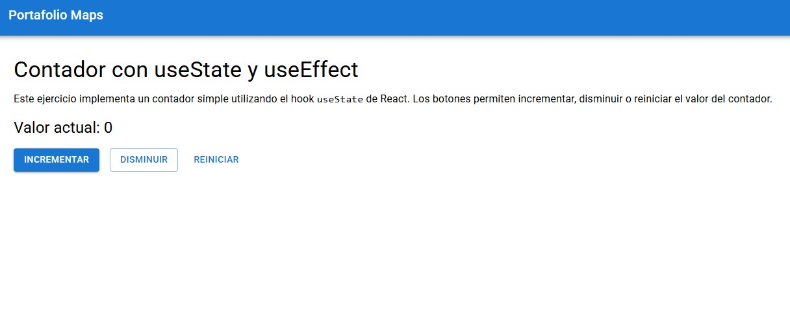
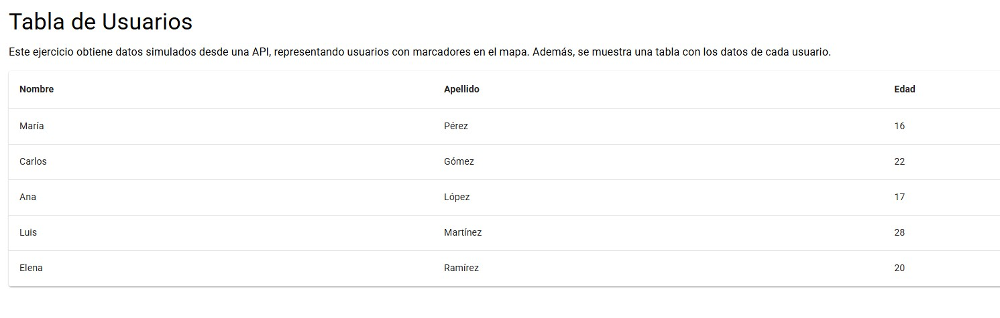
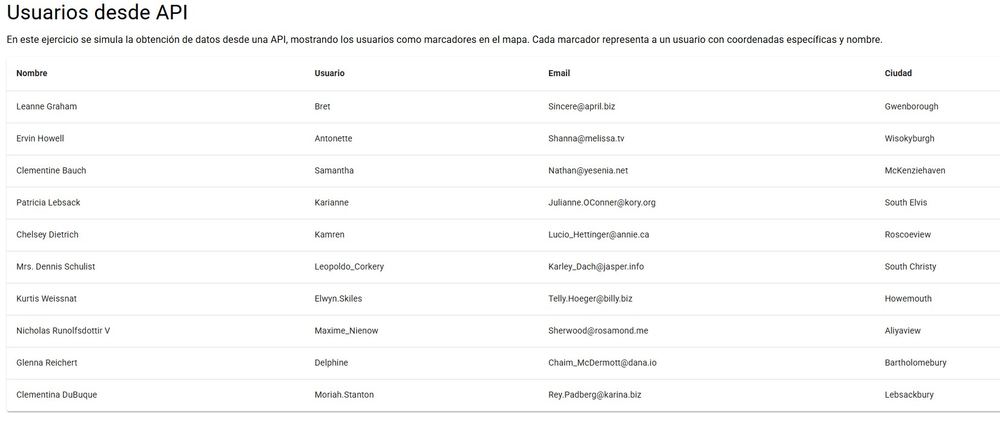
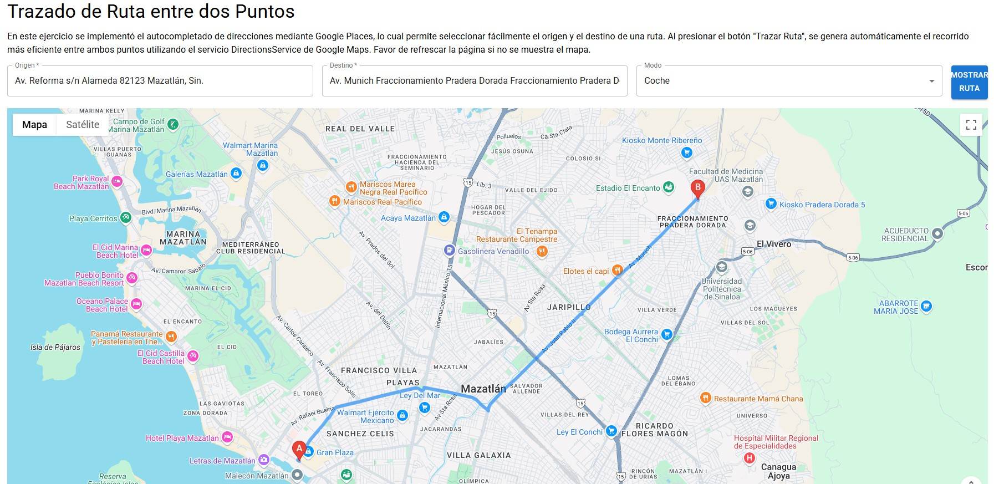
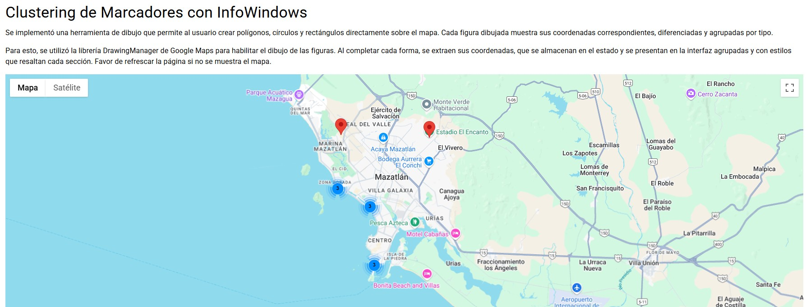
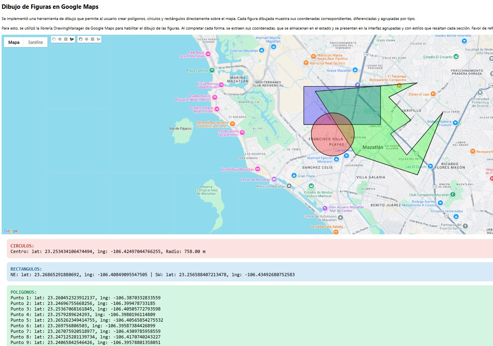
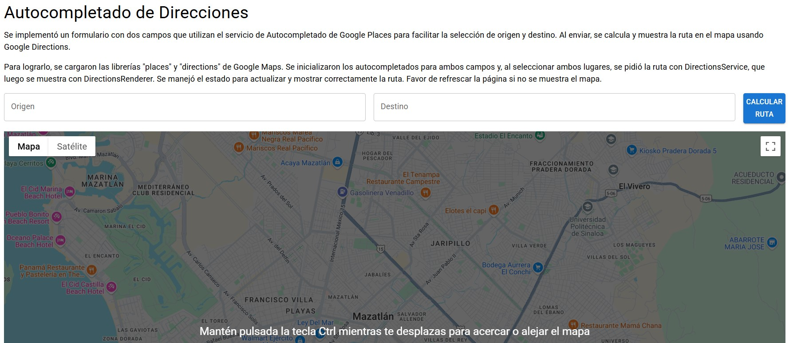

# Portafolio con Mapas Interactivos

**Autor:** Mariana Joandle Alvarez Cazares

Este proyecto muestra distintas implementaciones usando la API de Google Maps con React, incluyendo:

- Clustering de marcadores.
- Trazado de rutas entre dos puntos.
- Herramientas de dibujo de polígonos, círculos y rectángulos.
- Visualización de usuarios desde una API.
- Contador interactivo.
- Tabla de usuarios.

## 🚀 Proyecto desplegado

👉 [Ver en GitHub Pages](https://M-J-A-C.github.io/Portafolio)

## 📷 Capturas

### contador

### Tabla de Usuarios

### Usuarios API

### Mapa Basico

### Trazado de rutas

### Clustering

### Dibujo sobre el mapa

### Trazado Direcciones

## ⚙️ Tecnologías

- React
- Google Maps API
- GitHub Pages
- gh-pages
